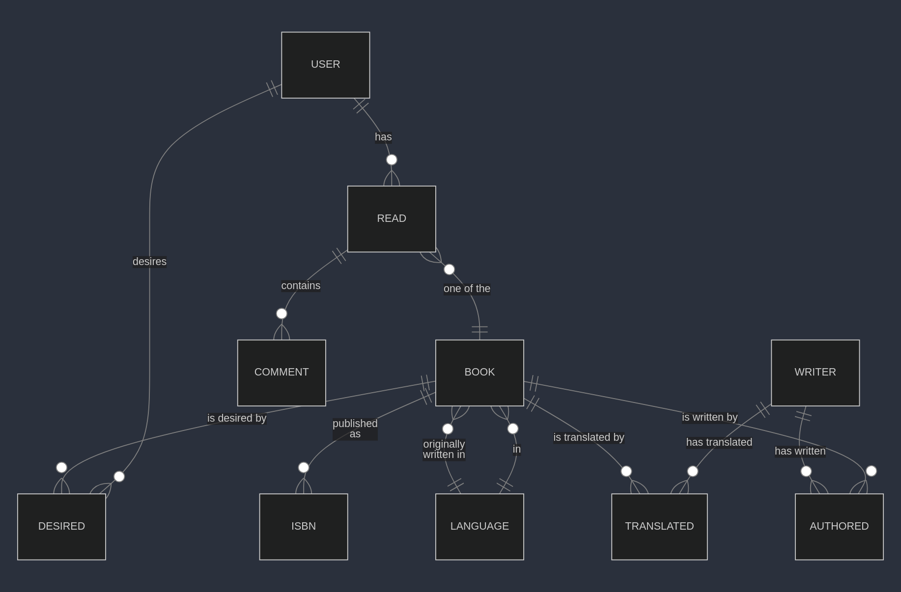

# Design Document

By Sergey Britvin

Video overview: https://youtu.be/oQhbynFmiUQ

## Scope

The database "DISERABLE BOOKS" for CS50 SQL includes entities to facilitate the process of tracking user reading progress
and leaving comments on books and user reading plans. In the database's scope are included:

* Users, including basic identifying information
* Books, including the language in which the book is published (relates to the Languages), the original language in which the book is originally written (relates to the Languages), the title, the original title which the book has in the original language, the genre and the age category
* Writers, representing people who can write a book or translate a book, including basic identifying information
* Languages, including the name of the language in English and the alpha2 - two characters abbreviation
* Book ISBNS, including the isbn - unique code, and the book to which the ISBN is related
* Authored, represeting the book and the writer pairs - which book is authored by which writer
* Translated, representing the book and the writer pairs - which book is translated by which writer
* Desired, representing the user and the book pairs - which book is desired (to be read) by which user
* Reads, representing the read attempt by the user, including the book which the user started to read, the started and the finished dates
* Comments from users, including the content of the comment, the read during wich the comment was left and the time at which the comment was left

Out of scope are: recommendations and ratings as such, availability/possession of the paper book relating to a user, and other specific non-core attributes (like the year of book publishing, the differentiation of desired books - more or less desired etc.).

## Functional Requirements

This database will support:

* CRUD operations for users, books, writers, isbns, desired, comments
* Tracking of books beeing read by users, including several reading starts by a user of a book
* Tracking of books desired by users
* Adding multiple comments while reading a book by a user
* Adding zero to multiple authors, translators, isbns for a book

Not supported:
* Adding several languages for a book (rare case, when book is written in more than one language)
* Adding several genres or age_categories for a book
* Adding writers with the same first and last name pairs

## Representation

Entities are captured in MySQL tables with the following schema.

### Entities

The database includes the following entities:

#### Users

The `users` table includes:

* `id`, which specifies the unique ID for the user as an `SMALLINT UNSIGNED`. This column thus has the `PRIMARY KEY` constraint applied. According to the MySQL documentation at <https://dev.mysql.com/doc/refman/8.0/en/integer-types.html>, `SMALLINT UNSIGNED` allows values up to 65535, which is enough for the project's purposes. `AUTO_INCREMENT` attribute is used for automatical generation of unique identities.
* `first_name`, which specifies the user's first name as `VARCHAR(32)` with up to 32 characters available for the field, which should be enough for the first name.
* `last_name`, which specifies the user's last name. The chosen type is used for the same reason as for `first_name`.
* `username`, which specifies the user's username. The chosen type is used for the same reason as for `first_name` and `last_name`. A `UNIQUE` constraint ensures no two students have the same username.
* `born`, which specifies the user's birth year as `YEAR`. According to the MySQL documentation at <https://dev.mysql.com/doc/refman/8.0/en/year.html>, supported range is 1901 - 2155, which is quite enough for the project's purposes.

All columns in the `users` table except the `first_name` and `last_name` are required and hence should have the `NOT NULL` constraint applied. No other constraints are necessary.

#### Languages

The `languages` table includes:

* `id`, which specifies the unique ID for the user as an `TINYINT UNSIGNED`. This column thus has the `PRIMARY KEY` constraint applied. According to the MySQL documentation at <https://dev.mysql.com/doc/refman/8.0/en/integer-types.html>, `TINYINT UNSIGNED` allows values up to 255, which is enough for the list of 183 languages described in ISO 639-1 standard and used in this project. The standard can be found at <https://datahub.io/core/language-codes#language-codes>. `AUTO_INCREMENT` attribute is used for automatical generation of unique identities.
* `alpha2`, which specifies the two character code for the language provided in the ISO, see description in `id`. A `UNIQUE` constraint ensures no two languages have the same `alpha2` code.
* `name`, which specifies the full descriptive name of the lanugage provided in the stadard, which is described in `id`.

All columns in the `languages` table are required and hence should have the `NOT NULL` constraint applied. No other constraints are necessary.

> [!NOTE]
> In the schema.sql, the table `languages` is populated with the data from the `language-codes.csv`\
> using MySQL statement 'LOAD DATA LOCAL' according to the MySQL [documentation]](https://dev.mysql.com/doc/refman/8.0/en/load-data.html).\
> If you face "ERROR 3950 (42000): Loading local data is disabled; this must be enabled on both the client and server side",\
> you might need to adjust your MySQL settings:\
> 1) mysql> SET GLOBAL local_infile=1;\
> 2) mysql> quit\
> 3) connect to the server with the local-infile system variable and other neede parameters, for example:\
>    mysql --local-infile=1 -h 127.0.0.1 -P 3306 -u root -p\
> 4) use your database and load the file into the table (see statement in `schema.sql`).\
>\
> Please refer to the following [article](https://stackoverflow.com/questions/59993844/error-loading-local-data-is-disabled-this-must-be-enabled-on-both-the-client).

#### Books

The `books` table includes:

* `id`, which specifies the unique ID for the book as an `SMALLINT UNSIGNED`. This column thus has the `PRIMARY KEY` constraint applied. According to the MySQL documentation at <https://dev.mysql.com/doc/refman/8.0/en/integer-types.html>, `SMALLINT UNSIGNED` allows values up to 65535, which is enough for the project's purposes. `AUTO_INCREMENT` attribute is used for automatical generation of unique identities.
* `title`, which specifies the book's title as `VARCHAR(100)` with up to 100 characters available for the field, which should be enough for the book title.
* `orig_title`, which specifies the book's original title (in original language) with the same data type as in `title`.
* `lang`, wich specifies the language in which book is published as an `TINYINT UNSIGNED`. This column has the `FOREIGN KEY` constraint applied, referencing the `id` column in the `languages` table to ensure data integrity.
* `orig_lang`, which specifies the language in which the book was originally written. The chosen type is used for the same reason as for `lang`. This column has the `FOREIGN KEY` constraint just as the `lang` column.
* `genre`, which specifies the genre of the book as an `ENUM()`, one of the available options can be selected for a book: 'fiction', 'non-fiction', 'traditional', 'biography', 'picture books', 'poetry'.
* `age_category`, which specifies the age category of the book asa en `ENUM()`, one of the available options can be selected for a book: 'pre-readers', 'early-readers', 'intermediate', 'middle grade', 'young adults', 'adults'.

All columns in the `books` table are required and hence should have the `NOT NULL` constraint applied. No other constraints are necessary.

#### Isbns

The `isbns` table includes:

* `book_id`, which specifies the book to which the isbn is related. The column is represented as an `SMALLINT UNSIGNED`. This column has the `FOREIGN KEY` constraint applied, referencing the `id` column in the `books` table to ensure data integrity.
* `isbn`, which specifies the isbn of the book as an `VARCHAR(17)` and allows to store up to 17 characters (sum of 13 digits and 4 hyphens or spaces according to the isbn-agency documentation at <https://www.isbn-international.org/content/what-isbn/10>. A `UNIQUE` constraint ensures one isbn is used only once.

Both fields `book_id` and `isbn` have `PRIMARY KEY` constraint applied, ensuring that every `book_id` and `isbn` pair are unique.
And as every `isbn` is unique, only one book can be related to the particular isbn.

All columns in the `isbns` table are required and hence should have the `NOT NULL` constraint applied. No other constraints are necessary.

#### Writers

The `writers` table includes:

* `id`, which specifies the unique ID for the writer as an `SMALLINT UNSIGNED`. This column thus has the `PRIMARY KEY` constraint applied. According to the MySQL documentation at <https://dev.mysql.com/doc/refman/8.0/en/integer-types.html>, `SMALLINT UNSIGNED` allows values up to 65535, which is enough for the project's purposes. `AUTO_INCREMENT` attribute is used for automatical generation of unique identities.
* `first_name`, which specifies the writer's first name as `VARCHAR(32)` with up to 32 characters available for the field, which should be enough for the first name.
* `last_name`, which specifies the writer's last name. The chosen type is used for the same reason as for `first_name`.
* `born`, which specifies the writer's birth year as `YEAR`. According to the MySQL documentation at <https://dev.mysql.com/doc/refman/8.0/en/year.html>, supported range is 1901 - 2155, which is quite enough for the project's purposes.

All columns in the `writers` table except the `born` are required and hence should have the `NOT NULL` constraint applied. No other constraints are necessary.

#### Authored

The `authored` table includes:

* `book_id`, which specifies the book authored by the writer specified in `writer_id`. The column is represented as an `SMALLINT UNSIGNED`. This column has the `FOREIGN KEY` constraint applied, referencing the `id` column in the `books` table to ensure data integrity.
* `writer_id`, which specifies the writer having authored the book specified in `book_id`. The column is represented as an `SMALLINT UNSIGNED`. This column has the `FOREIGN KEY` constraint applied, referencing the `id` column in the `writers` table to ensure data integrity.

Every pair of book and writer in the table must be unique, thus both `book_id` and `writer_id` have `PRIMARY KEY` constraint applied.

All columns in the `authored` table are required and hence should have the `NOT NULL` constraint applied. No other constraints are necessary.

#### Translated

The `translated` table includes:

* `book_id`, which specifies the book translated by the writer specified in `writer_id`. The column is represented as an `SMALLINT UNSIGNED`. This column has the `FOREIGN KEY` constraint applied, referencing the `id` column in the `books` table to ensure data integrity.
* `writer_id`, which specifies the writer having translated the book specified in `book_id`. The column is represented as an `SMALLINT UNSIGNED`. This column has the `FOREIGN KEY` constraint applied, referencing the `id` column in the `writers` table to ensure data integrity.

Every pair of book and writer in the table must be unique, thus both `book_id` and `writer_id` have `PRIMARY KEY` constraint applied.

All columns in the `translated` table are required and hence should have the `NOT NULL` constraint applied. No other constraints are necessary.

#### Desired

The `desired` table includes:

* `book_id`, which specifies the book desired by the user specified in `user_id`. The column is represented as an `SMALLINT UNSIGNED`. This column has the `FOREIGN KEY` constraint applied, referencing the `id` column in the `books` table to ensure data integrity.
* `user_id`, which specifies the user desiring the book specified in `book_id`. The column is represented as an `SMALLINT UNSIGNED`. This column has the `FOREIGN KEY` constraint applied, referencing the `id` column in the `users` table to ensure data integrity.

Every pair of book and user in the table must be unique, thus both `book_id` and `user_id` have `PRIMARY KEY` constraint applied.

All columns in the `desired` table are required and hence should have the `NOT NULL` constraint applied. No other constraints are necessary.

#### Reads

The `reads` table includes:

* `id`, which specifies the unique ID for the read (attempt) as an `INT UNSIGNED`. This column thus has the `PRIMARY KEY` constraint applied. According to the MySQL documentation at <https://dev.mysql.com/doc/refman/8.0/en/integer-types.html>, `INT UNSIGNED` allows values up to 4294967295, which is more than enough for the project's purposes. `AUTO_INCREMENT` attribute is used for automatical generation of unique identities.
* `book_id`, which specifies the book beeing read by the user specified in `user_id`. The column is represented as an `SMALLINT UNSIGNED`. This column has the `FOREIGN KEY` constraint applied, referencing the `id` column in the `books` table to ensure data integrity.
* `user_id`, which specifies the user reading the book specified in `book_id`. The column is represented as an `SMALLINT UNSIGNED`. This column has the `FOREIGN KEY` constraint applied, referencing the `id` column in the `users` table to ensure data integrity.
* `started`, which specifies date when user started reading the book. This column is represented as an `DATE`. According to the MySQL documentation at <https://dev.mysql.com/doc/refman/8.0/en/datetime.html>, the DATE type is used for values with a date part but no time part in supported range of 1000-01-01  to 9999-12-31, which is absolutely suitable for the project's purposes.
* `finished`, which specifies date when user finished reading the book. The type is chosed for the same reason as in `started`.

All columns in the `reads` table except `finished` are required and hence should have the `NOT NULL` constraint applied. No other constraints are necessary.

> [!NOTE]
> A user can start reading the same book several times, which can be tracked in the database.\
> User can leave reading attempt unfinished (`finished` remains NULL)\
> or finish reading attempt (`finished` stores appropriate DATE value).\
> If user have several unfinished reading attempts for the same book, there is no sense in finishing the older one,\
> thus the latter one reading attempt should be marked as finished, this functional is provided\
> in the stored procedure `finish_reading`.

#### Comments

The `comments` table includes:

* `id`, which specifies the unique ID for the comment as an `INT UNSIGNED`. This column thus has the `PRIMARY KEY` constraint applied. According to the MySQL documentation at <https://dev.mysql.com/doc/refman/8.0/en/integer-types.html>, `INT UNSIGNED` allows values up to 4294967295, which is more than enough for the project's purposes. `AUTO_INCREMENT` attribute is used for automatical generation of unique identities.
* `read_id`, which specifies the read (attempt) for which the comment is left. This column is represented as an `INT UNSIGNED`. This column has the `FOREIGN KEY` constraint applied, referencing the `id` column in the `reads` table to ensure data integrity.
* `content`, which specifies the content of the comment as an `VARCHAR(3000)`. According to the MySQL documentation at <https://dev.mysql.com/doc/refman/8.0/en/char.html>, this type allows to store up to 3000 characters with the minimum storage used, when less then maximum number of charactes used.
* `timestamp`, which specifies the date and time when comment was left. This column is represented as an `TIMESTAMP`. According to the MySQL documentation at <https://dev.mysql.com/doc/refman/8.0/en/datetime.html>, this type supports range of values from '1970-01-01 00:00:01' UTC to '2038-01-19 03:14:07' UTC, which suits project's needs. `DEFAULT` value is generated by the built-in MySQL function `NOW()`.

All columns in the `comments` table are required and hence should have the `NOT NULL` constraint applied. No other constraints are necessary.

> [!NOTE]
> Cases with different time zones are not considered.

### Relationships

The entity relationship diagram below describes the relationships among the entities in the database.

As detailed by the diagram:

* A book can be originally written in one and only one language. At the same time, 0 to many books can be originally written in one language. It is assumed, that a book can not be written in many languages simultaneously.
* A book can be published in one and only one language. At the same time, 0 to many books can be published in one language.
It is assumed, that a book can not be published in many languages simultaneously. Different translations of a book are considered different books.
* A book can be published in different editions and have many isbns, or can have 0 known isbns. At the same time isbn can be related to one and only one book.
* A book can be authored (written) by 0 to many writers. Thus one book can be present in the `authored` table in 0 to many unique pairs (book, writer). At the same time, a pair in the `authored` table can relate to one and only one writer.
* One writer is capable of writing of 0 to many books. Thus one writer can be present in `authored` table in 0 to many unique pairs (book, writer).
* A book can be translated by 0 to many writers. Thus one book can be present in the `translated` table in 0 to many unique pairs (book, writer). At the same time, a pair in the `translated` table can relate to one and only one writer.
* One writer is capable of translating of 0 to many books. Thus one writer can be present in the `translated` table in 0 to many unique pairs (book, writer).
* One user is capable of desiring 0 to many books. At the same time, a disired item is related to one and only one user.
* A book can be desired by 0 to many users. Thus one book can be present in the `desired` table in 0 to many unique pairs (book, user). At the same time, a desired item represents one and only one book.
* One user is capable of having 0 to many reading attempts (reads). At the same time, a reading attempt relates to one and only one user.
* A reading attempt is related to one and only one book. At the same time, a book can be read 0 to many times (by one or many users).
* A reading attempt can contain 0 to many comments. At the same time, a comment is related to one and only one reading attempt (read).

## Optimizations

For the typical queries, please see `queries.sql`.

### Views, Indexes, Stored Functions and Procedures

It is common to search for books by genre or age_category. For that reason indexes are created on the
`genre` and `age_category` columns in the `books` table to speed up search of books by those columns.
For that reason is available the stored procedures `books_in_genre` and `books_in_age_cat`.

It is common to search for books written by some writer. For that reason a unique index is created on the pair of `first_name` and `last_name` columns in the `writers` table to speed up search of the writers by those columns. (Writers with the same first and last name are not supported.) This index is used in such stored functions as `get_writerId()` and `get_bookId()`, in such stored procedures as `books_written_by`.

In many searches there is need to find the user_id, for this reason is used the stored function `get_userId()`, which accepts `username` as a string argument. In order to optimize the search for the username, index on the `username` column in the `users` table is created. (This index and/or function is used in the following stored procedures: `books_desired_by`, `books_desired_never_started_by`, `books_started_never_finished_by`, `books_ever_finished_by`, `books_started_notyet_finished_by`, `comments_on_book`, `start_reading`, `finish_reading`, `leave_comment`, which will are described below.)

In many searches there is need to find the book_id, for this reason is used the stored function `get_bookId()`, which accepts title of the book, first and last name of the author as string arguments. In order to optimize the search for the title, index on the `title` column in the `books` table is created. (This index and/or function is used in the stored procedure `comments_on_book`).
This function utilizes another stored function `get_writerId()`.

In many searches there is used the VIEW `books_with_authors`, which lists all the books along with all authors for every book
represented as array in `writer` column. No indexes needed in this case, see [Those Primary Keys](#Those-primary-keys).

For common searches for those books desired by the user, there is the stored procedure `books_desired_by` available.
For common searches for those books desired by the user but never started, there is the stored procedure `books_desired_never_started_by`.
Many users would want to know, which books they started but never finished. For that reason there is the stored procedure `books_started_never_finished_by`.
Many users would want to know, which books they have ever finished reading. For that reason there is the stored procedure `books_ever_finished_by`.
Some users might want to know, which books they have started but not yet finished. For that reason there is the stored procedure `books_started_notyet_finished_by`.
All these procedures accept username as a string argument.
All these procedures except the `books_desired_by` suppose to search for books and users among the reads (read attempts), for that reason indexes are created on the `book_id` and `user_id` columns in the `reads` table to speed up search by that columns.

The procedure `books_started_never_finished_by` utilizes the function `get_latter_started()`, which needs to search for the latter (max) date at which the reading was started. It was considered not reasonable to create an index on the `started` column in the `reads` table, because usually a user does not have so many reads.

The procedure `books_ever_finished_by` utilizes the function `get_latter_finished()`, which needs to search for the latter (max) date at which the reading was finished. It was considered not reasonable to create an index on the `finished` column in the `reads` table with the same reasoning as for the previosly descussed `get_latter_started()`.

The procedure `books_started_notyet_finished_by` utilizes the functions `get_latter_started()` and `get_latter_finished()`, which was discussed above regarding the procedures `books_started_never_finished_by` and `books_ever_finished_by`.

It is common for a user to search for comments ever left while reading a book. For this reason there is the stored procedure `comments_on_book`, which identifies the needed comments by the `read_id`, thus an index on the `read_id` column in the `comments` table is created to speed up search by that column. By the way, previosly created indexes for the `user_id` and `book_id` in the `reads` table are utilized in the procedure and speed up the search of reads attempted by the user for the book.

It is common to add a new book into the database. And it is wishfull to relate the book to its author. For that reason there is the stored procedure `add_new_book`, which accepts all the needed data about the book and the `writer_id` for the author as arguments (writer_id can be obtained via the function `get_writerId()`). The book is inserted into the `books` table. And if the `writer_id` was successfully found, the pair of book and writer is inserted into the `authored` table.

The procedure `add_new_book` utilizes the function `get_langId()`, which obtains the `id` for a language by searching for the human readable two-letters language code provided in the data concerning the book. For the reason of optimizing the search for language code, index on the `alpha2` columnt in the `languages` table is created.

It is common to start reading a book. For that reason there is the stored procedure `start_reading`, which accepts book_id and username as arguments (book_id can be obtained via the function `get_bookId()`).
This procedure utilizes the stored function `get_userId()`.

It is common to finish reading a book. For that reason there is the stored procedure `finish_reading`, which accepts book_id and username as arguments (book_id can be obtained via the function `get_bookId()`). The procedure updates the latter started reading attempt. (No check, if the read has already been finished.)

It is common to leave comment while reading a book. For that reason there is the stored procedure `leave_comment`, which accepts book_id, username and content of comment as arguments (book_id can be obtained via the function `get_bookId()`). The procedure leaves comment for the latter started reading of the book.

This procedures `finish_reading` and `leave_comment` utilize the stored functions `get_userId()` and `get_latter_read`.
The function `get_latter_read` allows to find the latter started reading, it utilizes the previously discussed index on `book_id` and `user_id` columns in the `reads` table.

### Those Primary Keys
According to the MySQL documentation at <https://dev.mysql.com/doc/refman/8.4/en/primary-key-optimization.html>,
there is no need to create INDEX for the columns `book_id`, `user_id` in the `desired` table, and the
`book_id`, `writer_id` in the `authored` and `translated` tables, because these tables consist of two keys,
both of which are included in PRIMARY KEY, and thus both automatically indexed.

This automatically indexed columns are used in several ways:
* `book_id` in `authored` - for getting the list of books with the authors' names, which can be done via the VIEW `books_with_authors`,
which is used in many stored procedures
* `writer_id` in `authored` - for search of comments on some book left by a user, which can be done via the stored procedure `comments_on_book`
* `user_id` in `desired` - for common searches for books desired by the user, which can be performed via the stored procedures `books_desired_by` and `books_desired_never_started_by`; this indexed columns are also utilized in such stored procedure as `comments_on_book` and such functions as `get_writerId()`, `get_bookId()`.

## Limitations

Writers with the same first and last names are not supported by design. Allowing namesakes requires changes in some stored functions and procedures.

By finishing reading, there is no check, if the read attempt has already been finished.

By leaving a comment for a book, there should be implemented some procedure or function to get the content of comment from a file or other convenient resource.

Several genres, age categories for a book simultaneously are not supported by design. Such feature would require implementing of arrays as values for the mentioned columns or an extra tables representing one-to-one-or-many relationship between book and genre/age_category.
